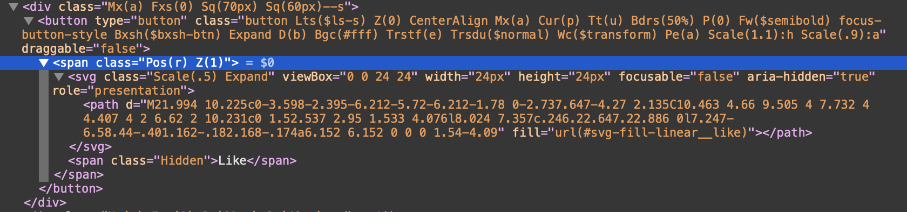

# Tinder Auto Like Code

This is a simple auto like code for tinder.

## IMPORTANT UPDATE
```bash
Sadly tinder has update their code. 
Because of this, you need to edit some codes and after that this js will work perfectly.

First, open developer console and find this code. Or simple you can right click the like button and then click the Inspect section.
In this code section, you need to change the class="Pos(r) Z(1)" value to class="likebutton" . 
Then paste the JS code into the console section.
```

## Change this code !


## Warning!

If you are not using the Tinder in English language, then you need to change the button name in the code.
If you don't change the button name, this code will not work.
